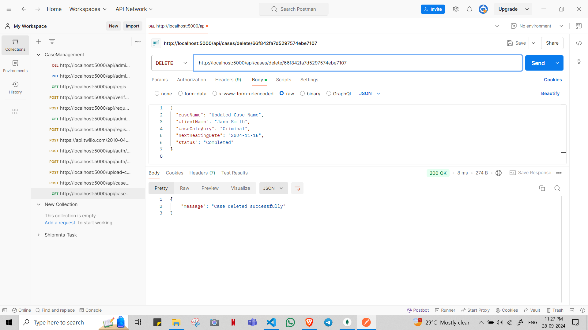
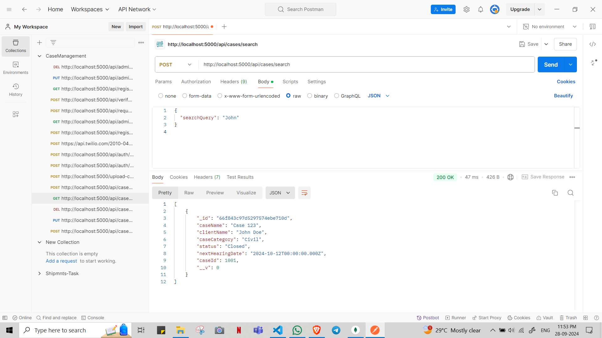

# 1. Signup Route
Endpoint: /api/auth/signup
Method: POST

## Test 1: Successful Signup

## Test 2: Signup with invalid email

## Test 3: Signup with a short password

# 2. Login Route
Endpoint: /api/auth/login
Method: POST

## Test 1: Successful Login

## Test 2: Login with invalid email or password

# 3. File Upload Route
Endpoint: /upload-case-files
Method: POST

## Test 1: Upload multiple files

# 3.Case Routes

## Test 1: Create a Case // Can also pass lawyerEmail , lawyerPhone, clientEmail , clientPhone
 

## Test 2: Get All Cases

## Test 3: Get Case by ID

## Test 4: Update Case

## Test 5: Delete Case

## Test 6: Update Case Status

## Test 7: Send Hearing Reminder

## Test 8: Search Cases

# 4 Notice 

## Test 1: Create Notice

## Test 2: Update Payment for a Notice
    input data

    response

## Test 3: Get all notices

## Test 4: Get Notice by ID

## Test 5: Delete a Notice

# 5 Payment Testing

# 6 Special Message Route

## Test 1: Send a message on registered mobile no.

# 7 an endpoint for general purpose

